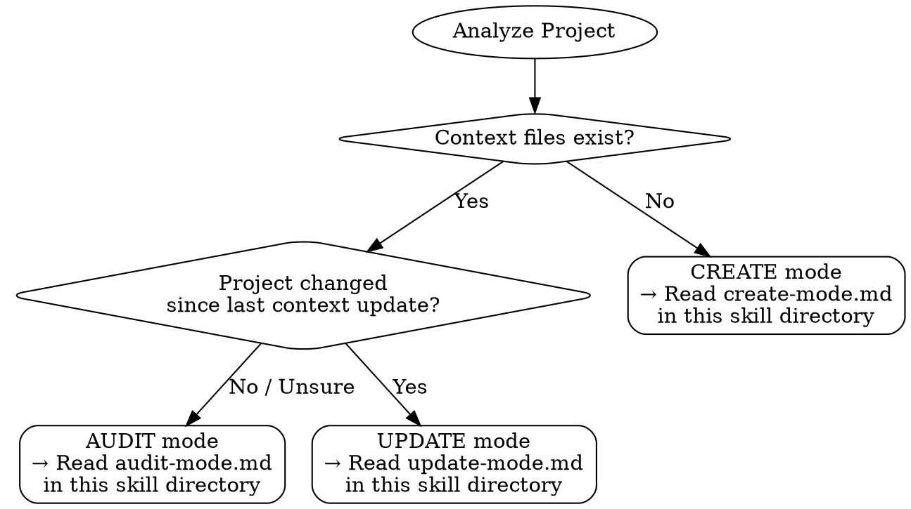

# Context Architect

Structural context management skill. Core principle: **structure over volume**.
Manages two-layer context architecture (index + reference docs) for AI-assisted projects.

## The Iron Law

```
NO CONTEXT WITHOUT STRUCTURAL JUSTIFICATION
```

Every piece of context must justify its presence. If it fails the 3 tests (Public Knowledge, Default vs Custom, Discoverable), it doesn't belong.

## Core Principles

1. **Role Separation** — One file = one role. Never mix behavior rules, tool specs, style guides, build commands, and project descriptions in a single file.

2. **Minimal Injection** — "Is this always needed?" If no → move to docs. If yes → keep it minimal. Every line injected has a cost.

3. **Static vs Dynamic** — Static files (CLAUDE.md) never contain session state. Dynamic files (MEMORY.md) never contain permanent rules. Mixing causes stale context.

4. **Index, Not Content** — CLAUDE.md is a map, not an encyclopedia. Link to content, don't embed it. The agent loads what it needs on demand.

5. **Knowledge Diff** — Don't tell the AI what it already knows. Verify with a fresh probe before including any standard framework knowledge.

## Two-Layer System

- **Layer 1: Context Files** — CLAUDE.md acts as a minimal index/map. Always injected.
- **Layer 2: Reference Docs** — On-demand content discovered via links from Layer 1. Can live anywhere in the project.
- The agent loads Layer 1 always, Layer 2 only when relevant to the current task.

## Scope Detection

- **Default:** Parse CLAUDE.md, follow all file links → that defines the audit/update scope.
- **Optional:** `.context-architect.json` manifest for additional scope, ignores, and probe model config.
- No manifest is needed for basic usage — link-based scope is sufficient.

## Mode Dispatch

Determine which mode to enter based on project state:



- **No context files exist?** → CREATE mode — Read `create-mode.md` in this skill directory
- **Existing context files?** → AUDIT mode — Read `audit-mode.md` in this skill directory
- **Project changed, context needs sync?** → UPDATE mode — Read `update-mode.md` in this skill directory

## Output Format

All modes produce reports with this structure:

1. **Current State Summary** — What exists now
2. **Risk Rating** — Low / Medium / High (based on CCS score)
3. **Over-specification Detection** — Findings from analysis
4. **Recommended Structure** — Proposed file/link architecture
5. **Fix Proposals** — Concrete changes (user approves before applying)
6. **Reasoning Cost Impact** — Before/after token injection estimate

## Rationalization Prevention

| Excuse | Reality |
|--------|---------|
| "More context = better results" | Paper proved this wrong. Over-specification increases failure rate. |
| "Just add it to CLAUDE.md" | Does it pass the "always needed?" test? |
| "It's only a few lines" | Lines compound. CCS doesn't lie. |
| "The agent needs to know everything" | Agents need structure, not volume. |
| "This framework is niche" | Probe it. The AI might know it fine. |
| "Better safe than sorry" | Redundant context increases reasoning cost for every task. |

## Niche Repo Exception

Context beyond minimal is allowed when **2+ of these conditions** are met:

- README is insufficient or missing
- Build/test methods are unclear or non-standard
- Legacy codebase with undocumented conventions
- Complex or unusual tool dependencies
- Critical documentation is missing

Otherwise: minimal-only. The Iron Law still applies to each individual item.

## User Language Rule

All user-facing reports MUST be written in the **user's language**. Internal skill files and tool output remain in English.
